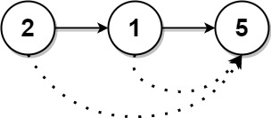
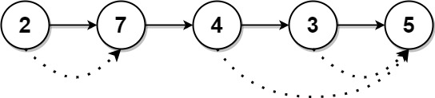

# [1019. Next Greater Node In Linked List](https://leetcode.com/problems/next-greater-node-in-linked-list/description/)

You are given the <code>head</code> of a linked list with <code>n</code> nodes.

For each node in the list, find the value of the **next greater node** . That is, for each node, find the value of the first node that is next to it and has a **strictly larger** value than it.

Return an integer array <code>answer</code> where <code>answer[i]</code> is the value of the next greater node of the <code>i^th</code> node (**1-indexed** ). If the <code>i^th</code> node does not have a next greater node, set <code>answer[i] = 0</code>.

**Example 1:**



```
Input: head = [2,1,5]
Output: [5,5,0]
```

**Example 2:**



```
Input: head = [2,7,4,3,5]
Output: [7,0,5,5,0]
```

**Constraints:**

- The number of nodes in the list is <code>n</code>.
- <code>1 <= n <= 10^4</code>
- <code>1 <= Node.val <= 10^9</code>
