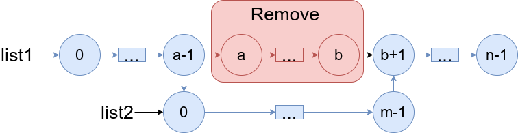
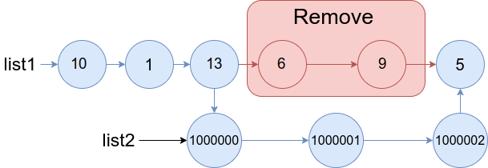
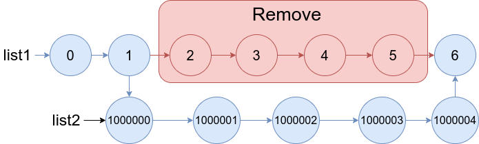

# [1669. Merge In Between Linked Lists](https://leetcode.com/problems/merge-in-between-linked-lists/description/)

You are given two linked lists: `list1` and `list2` of sizes `n` and `m` respectively.

Remove `list1`'s nodes from the `a^th` node to the `b^th` node, and put `list2` in their place.

The blue edges and nodes in the following figure indicate the result:



Build the result list and return its head.

**Example 1:**



**Input:**

```
list1 = [10,1,13,6,9,5], a = 3, b = 4, list2 = [1000000,1000001,1000002]
```

**Output:**

```
[10,1,13,1000000,1000001,1000002,5]
```

**Explanation:**

```
We remove the nodes 3 and 4 and put the entire list2 in their place. The blue edges and nodes in the above figure indicate the result.
```

**Example 2:**



**Input:**

```
list1 = [0,1,2,3,4,5,6], a = 2, b = 5, list2 = [1000000,1000001,1000002,1000003,1000004]
```

**Output:**

```
[0,1,1000000,1000001,1000002,1000003,1000004,6]
```

**Explanation:**

```
The blue edges and nodes in the above figure indicate the result.
```

**Constraints:**

- `3 <= list1.length <= 10^4`
- `1 <= a <= b < list1.length - 1`
- `1 <= list2.length <= 10^4`

**_Topics_**
`Senior`
`Linked List`

- **_Hint 1_**
  Check which edges need to be changed.
- **_Hint 2_**
  Let the next node of the (a-1)th node of list1 be the 0-th node in list 2.
- **_Hint 3_**
  Let the next node of the last node of list2 be the (b+1)-th node in list 1.
