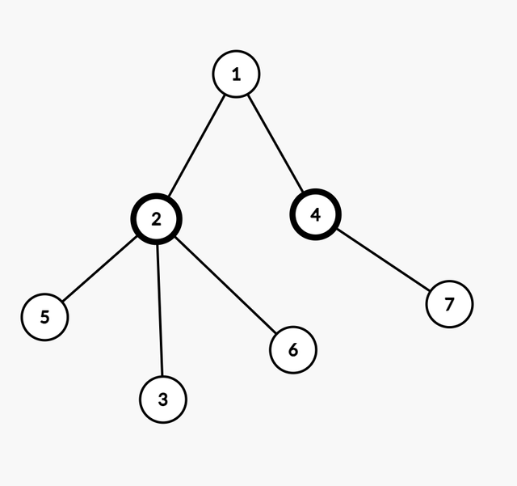

### **Problem**

Given an undirected connected tree with **N** nodes, numbered from **1** to **N**, and rooted at node **1**, find the length of the diameter of the tree (**Note:** Diameter of a tree is the longest path between any two nodes. There can be more than one diameter of a tree with the same length).

For example, in the following tree, length of the tree's diameter is 4. (one of the diameters is 5-2-1-4-7)

<p align="center">

</p>

### **[Solution](#java-solution)**

### **Constraints**

* $1 \le N \le 100000$
* $1 \le u_i, v_i \le N$

### **Input Format**

- The first line of the input contains a single integer — the number of nodes.
- The next lines describe the edges. The -th of these lines contains two space-separated integers and , denoting a bidirectional edge between and .

### **Output Format**

- Output on the single line, the length of the diameter of given tree.

---

### **Sample 1:**

**Input**

```text
7
1 2
1 4
2 5
2 3
2 6
4 7

```

**Output**

```text
4

```

---

### **JAVA Solution**

```java
import java.util.*;

public class Main {
    static List<Integer>[] adj;
    static int farthestNode;
    static int maxDistance;

    public static void main(String[] args) {
        Scanner sc = new Scanner(System.in);
        int n = sc.nextInt();
        if (n <= 1) {
            System.out.println(0);
            return;
        }

        adj = new ArrayList[n + 1];
        for (int i = 1; i <= n; i++) {
            adj[i] = new ArrayList<>();
        }

        for (int i = 0; i < n - 1; i++) {
            int u = sc.nextInt();
            int v = sc.nextInt();
            adj[u].add(v);
            adj[v].add(u);
        }

        // Step 1: Find the farthest node from an arbitrary node (node 1)
        maxDistance = -1;
        dfs(1, -1, 0);

        // Step 2: Find the farthest node from the node found in Step 1
        maxDistance = -1;
        dfs(farthestNode, -1, 0);

        // Output the maximum distance found in the second DFS
        System.out.println(maxDistance);
    }

    static void dfs(int node, int parent, int distance) {
        if (distance > maxDistance) {
            maxDistance = distance;
            farthestNode = node;
        }

        for (int neighbor : adj[node]) {
            if (neighbor != parent) {
                dfs(neighbor, node, distance + 1);
            }
        }
    }
}

```
